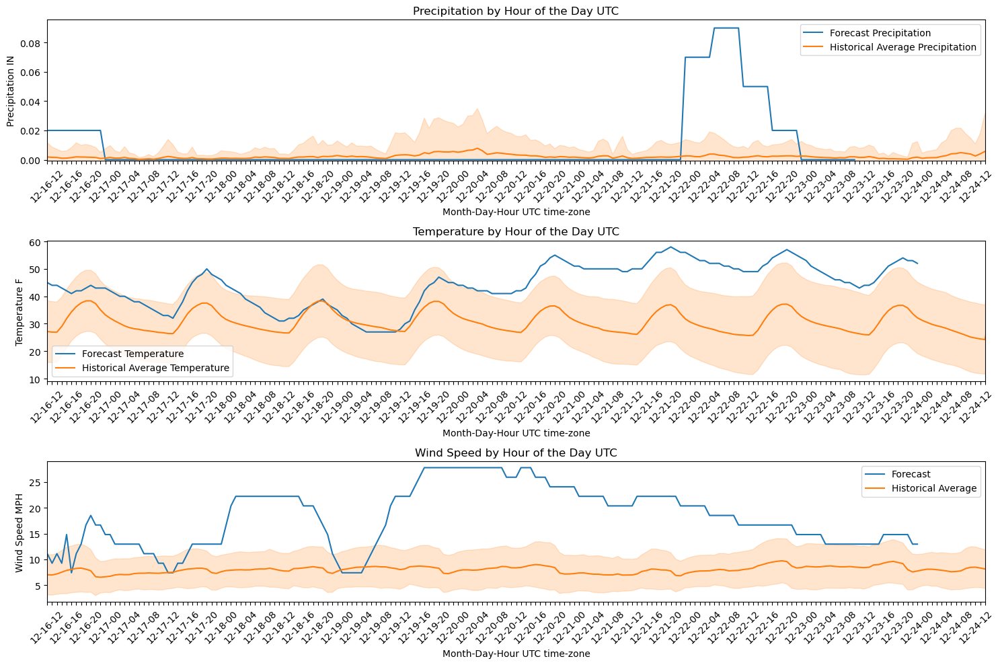

# weather386
`weather386` is a Python package developed as part of a data science class at Brigham Young University (BYU). It provides an easy-to-use interface for accessing and visualizing weather forecast and historical data. Built with simplicity in mind, it offers several functions that allow users to quickly retrieve and analyze weather data from sources like the National Weather Service. **all times are in UTC timezone as customary with weather data**

## Website
https://lightningcookies.github.io/weather386/

## Installation Instructions

To install `weather386`, you can use pip:

```bash
pip install weather386
```

## Usage example

Here is a basic example on how to use this package.
First, import all the necessary functions from the package
```python
from weather386.forecast import get_forecast
from weather386.history import get_history
from weather386.join_clean import join_clean
from weather386.combined_graph import combined_graph
```
Next, specify your latitude and longitude measurements. If
you are unsure of the coordinates you want to use, 
https://www.latlong.net/ is a great website to use! We will use
Kansas City in this example. Then use your specified latitude and longitude measurements with `get_forecast()` to return the weather forecast.
```python
latitude = 39.0997
longitude = -94.5786
forecast = get_forecast(latitude,longitude)
```
Next, call the `get_history()` function with the same latitude, longitude values used to get the forecast.
```python
history = get_history(latitude,longitude)
```
The forecast dataframe needs to be cleaned. Let's do that here with the `join_clean()` function. Out will come a nice and clean dataframe.
```python
forecast_clean = join_clean(forecast)
```
We are ready to get our graphs! Simply call the `combined_graph()` function with your cleaned forecast dataframe and your history dataframe.
```python
combined_graph(history, forecast_clean)
```


# Contribution guidelines
Contributions are always welcome! If you'd like to contribute, please follow these steps:

1. Fork the repository.
2. Create a new branch for your feature or bug fix.
3. Write your code and add tests.
4. Submit a pull request with a clear description of your changes.

# Licensing information
'weather386' is licensed under the MIT License. See the LICENSE file for more details.

# Contact and support
contact @Coleslaugh1 or @lightningcookies

# Citations:
Zippenfenig, Patrick. Open-Meteo.com Weather API., Zenodo, 2023, doi:10.5281/ZENODO.7970649.

Hersbach, H., Bell, B., Berrisford, P., Biavati, G., Horányi, A., Muñoz Sabater, J., Nicolas, J., Peubey, C., Radu, R., Rozum, I., Schepers, D., Simmons, A., Soci, C., Dee, D., Thépaut, J-N. (2023). ERA5 hourly data on single levels from 1940 to present [Data set]. ECMWF. https://doi.org/10.24381/cds.adbb2d47

Muñoz Sabater, J. (2019). ERA5-Land hourly data from 2001 to present [Data set]. ECMWF. https://doi.org/10.24381/CDS.E2161BAC

Schimanke S., Ridal M., Le Moigne P., Berggren L., Undén P., Randriamampianina R., Andrea U., Bazile E., Bertelsen A., Brousseau P., Dahlgren P., Edvinsson L., El Said A., Glinton M., Hopsch S., Isaksson L., Mladek R., Olsson E., Verrelle A., Wang Z.Q. CERRA Sub-Daily Regional Reanalysis Data for Europe on Single Levels from 1984 to Present. ECMWF, 2021, doi:10.24381/CDS.622A565A.


https://api.weather.gov
https://www.weather.gov/documentation/services-web-api

